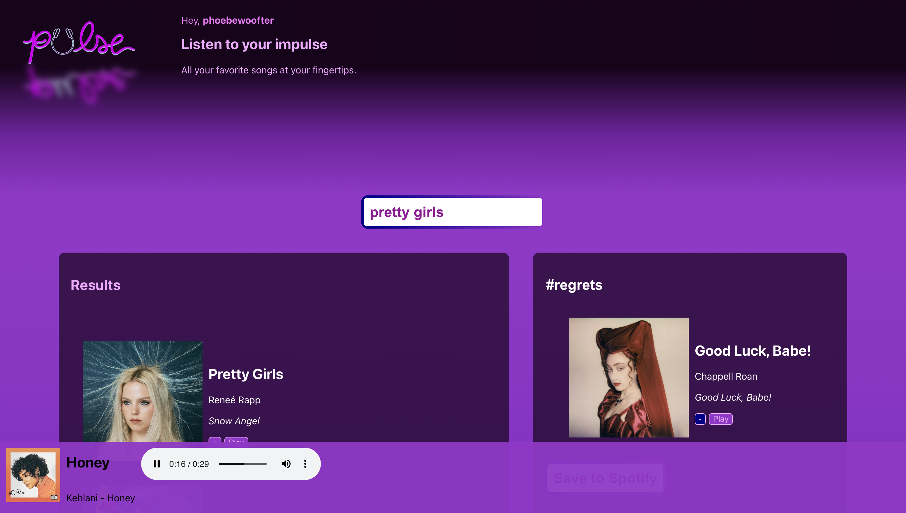

# PULSE 🎧

Pulse is a `React` project developed by Phoebe Woofter, an aspiring developer and current Codecademy student. The application prompts users log in to Spotify so they can search for music in the Spotify library, listen to track previews, create personalized playlists, and save them to their Spotify account.





## 📝 &nbsp; Note
Pulse is currently in development mode with the Spotify API. 


## 🔗 &nbsp; Link
Live site coming soon!


## 🎤 &nbsp; Features
*Authentication:* Users can log in to Spotify.\
*Search:* Users can search for songs through the Spotify Web API.\
*Playlist Creation and Management:* Users can create their own playlists, name them, and add or remove tracks. They can also upload those playlists to Spotify.\
*Audio Preview:* Users can view information about tracks and albums while listening to an audio preview.


## 🎥 &nbsp; Coming Soon
**Current features in development...**\
*Advanced Playlist Management:* Users will be able to change their playlist cover art.\
*Recommendations:* Users will be greeted with a pop up of recommended music based on their favorite (or most-played) artists, genre preferences, and overall listening habits.\
*Optimization:* The app will be more responsive with improved UI and navigation so users have a frictionless, enjoyable listening experience.\
*Lyrics Display:* Users will have access to the lyrics of the currently playing track.


## 🛠️ &nbsp; Installation
```git clone https://github.com/phoebewoofter/pulse.git```\
```npm install```\
```npm start```


## 💻 &nbsp; Technologies


## 👤 &nbsp; Contact
LinkedIn\
Phoebe Woofter\
phoebewoofter@gmail.com
